# GOD MODE AI — Phase 1: Architecture & Folder Structure

> **Status:** Phase 1 of 12. This document defines the system architecture, the complete
> folder structure, and a full 14-point specification for every major component. No business
> logic is implemented yet — this is the blueprint the remaining phases build against.
>
> **Approval gate:** Review and approve this document before Phase 2 (Core Framework) begins.

---

## 1. Vision

GOD MODE AI is a multi-agent **AI operating system**, not a chatbot. It plans, reasons,
delegates, remembers, and orchestrates tools across a strict three-tier command hierarchy.
The design target is the kind of platform an OpenAI / Anthropic / Microsoft / Google team
would build: modular, cloud-native, observable, and scalable to **hundreds of agents**.

Three non-negotiable architectural rules drive every decision below:

1. **The King never works.** It only understands, decomposes, assigns, monitors, and merges.
2. **Every agent is replaceable.** Agents share one base contract and one response schema, and
   never call each other directly — all communication flows through the Event Bus.
3. **No monolith.** Each module is an independently testable, independently deployable unit
   behind a clean interface.

---

## 2. Design Principles

| Principle | How it is applied |
|---|---|
| **SOLID** | Single-responsibility per agent/module; interfaces over implementations; small composable contracts. |
| **Clean / Hexagonal Architecture** | Domain (agents, workflows) is isolated from adapters (DB, Redis, Qdrant, LLM SDKs, HTTP) via ports. |
| **Dependency Injection** | A central container wires adapters into the domain; nothing instantiates its own infra. |
| **Repository Pattern** | All persistence goes through repositories, never raw ORM calls in business logic. |
| **Factory Pattern** | `AgentFactory` / `ToolFactory` build instances from registries by name. |
| **Strategy Pattern** | LLM providers, memory backends, and routing policies are swappable strategies. |
| **Domain-Driven Design** | Bounded contexts: Orchestration, Agents, Memory, Tools, Identity, Observability. |
| **Async-first** | `asyncio` end-to-end; all I/O is non-blocking. |
| **Typed & tested** | Full type hints, Pydantic schemas, unit + integration tests per module. |

---

## 3. Tech Stack

**Backend:** Python 3.12+, FastAPI, Pydantic, AsyncIO, SQLAlchemy (async), Alembic,
PostgreSQL, Redis, Qdrant (vector DB), LangGraph (optional), Celery (optional), WebSockets,
JWT/OAuth2, NGINX, Docker, Docker Compose, AWS ECS/Fargate.

**Mobile:** Flutter (Android + iOS), Material 3, Riverpod, WebSockets, push notifications,
offline storage, voice (later).

**Data:** PostgreSQL (relational state), Redis (cache/queues/locks/session), Qdrant
(embeddings / semantic memory).

---

## 4. System Hierarchy

```
                            ┌────────────┐
                            │ KING AGENT │  orchestrate only — never executes work
                            └─────┬──────┘
                                  │  tasks ↓        results ↑
        ┌──────────────┬──────────┼───────────┬───────────────┐
        │              │          │           │               │
   ┌────▼────┐    ┌────▼────┐ ┌───▼────┐ ┌────▼────┐     ┌─────▼─────┐
   │Knowledge│    │Planning │ │Coding  │ │Finance  │ ... │Automation │   GENERALS (domain coordinators)
   │ General │    │ General │ │General │ │General  │     │  General  │
   └────┬────┘    └────┬────┘ └───┬────┘ └────┬────┘     └─────┬─────┘
        │              │          │           │                │
   ┌────▼────┐    ┌────▼────┐ ┌───▼────┐ ┌────▼────┐     ┌─────▼─────┐
   │Internet │    │Research │ │ Git    │ │ Stock   │ ... │  Docker   │   SOLDIERS (single responsibility)
   │ Soldier │    │ Soldier │ │Soldier │ │ Soldier │     │  Soldier  │
   └─────────┘    └─────────┘ └────────┘ └─────────┘     └───────────┘
```

**Generals (10):** Knowledge · Planning · Execution · Memory · Coding · Media · Finance ·
Communication · System · Automation.

**Soldiers (40+):** Internet, Weather, Maps, Research, Coding, Vision, Camera, Audio, Search,
Memory, Calendar, Reminder, Email, WhatsApp, News, Finance, Stock, Crypto, Shopping,
Translation, File, OCR, PDF, Terminal, Git, Docker, AWS, Kubernetes, Database, Security,
Authentication, Image, Video, Music, Movie, Speech, Tool, API, Monitoring, Logging,
Notification.

### 4.1 Request lifecycle (end-to-end sequence)

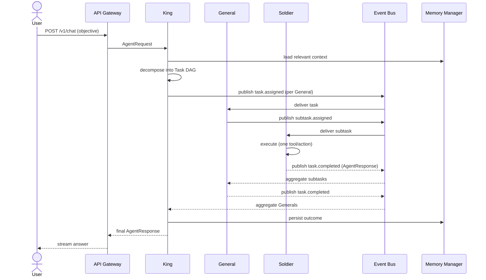

---

## 5. Complete Folder Structure

```
god_mode_ai/
├── README.md
├── pyproject.toml
├── requirements.txt
├── .env.example
├── .gitignore
├── backend/
│   ├── api/
│   │   ├── main.py                 # FastAPI entrypoint
│   │   ├── middleware/             # auth, rate-limit, logging, CORS
│   │   └── v1/
│   │       ├── routes/             # REST endpoints
│   │       └── websockets/         # streaming + agent comms
│   ├── core/                       # platform framework (Phase 2)
│   │   ├── base_agent.py           # BaseAgent contract
│   │   ├── agent_manager/
│   │   ├── task_manager/
│   │   ├── workflow_engine/
│   │   ├── message_bus/
│   │   ├── event_bus/
│   │   ├── tool_registry/
│   │   ├── memory_manager/
│   │   ├── scheduler/
│   │   ├── permission_manager/
│   │   ├── config/
│   │   ├── logger/
│   │   ├── metrics/
│   │   └── health/
│   ├── king/                       # King agent (Phase 4)
│   ├── generals/                   # 10 generals (Phase 5)
│   │   ├── knowledge/ planning/ execution/ memory/ coding/
│   │   ├── media/ finance/ communication/ system/ automation/
│   ├── soldiers/                   # 40+ soldiers (Phase 6)
│   │   ├── base/                   # BaseSoldier
│   │   ├── knowledge/ media/ finance/ communication/ system/ automation/
│   ├── memory/                     # memory subsystem (Phase 7)
│   │   ├── short_term/ long_term/ semantic/ conversation/
│   ├── database/
│   │   ├── repositories/           # Repository pattern
│   │   └── migrations/             # Alembic
│   ├── tools/                      # tool orchestration (Phase 8)
│   │   ├── providers/              # OpenAI/Anthropic/Gemini/local
│   │   └── mcp/                    # MCP server adapters
│   ├── services/                   # application services
│   ├── security/                   # JWT/OAuth2/RBAC/secrets/audit
│   ├── workflows/                  # workflow definitions
│   ├── models/                     # SQLAlchemy ORM models
│   ├── schemas/                    # Pydantic schemas (agent.py = shared envelope)
│   ├── utils/
│   ├── config/                     # settings.py
│   └── tests/  (unit/ integration/)
├── docker/                         # Dockerfile, docker-compose.yml
├── deployment/  (aws/ k8s/)        # IaC + manifests (Phase 12)
├── docs/  (architecture.md, diagrams/)
├── scripts/
└── mobile/flutter/                 # Flutter app (Phase 10)
```

---

## 6. Shared Contracts (used by every component)

**`AgentRequest`** — uniform envelope passed *down* the hierarchy: `request_id`, `parent_id`,
`objective`, `context`, `deadline`.

**`AgentResponse`** — uniform envelope returned *up* the hierarchy: `request_id`, `agent_id`,
`tier`, `status`, `result`, `error`, `latency_ms`, `created_at`. **Every agent at every tier
returns this exact shape** — this is what makes agents interchangeable.

**`BaseAgent`** — abstract base inherited by King, Generals, and Soldiers. Required methods:
`initialize()`, `execute()`, `validate()`, `health_check()`, `shutdown()`.

Both are stubbed already in `backend/schemas/agent.py` and `backend/core/base_agent.py`.

---

# 7. Component Specifications (14-point)

Each component below is specified against the required 14 points: **(1) Purpose · (2) Folder ·
(3) Classes · (4) Interfaces · (5) Responsibilities · (6) Dependencies · (7) Database Tables ·
(8) API Endpoints · (9) Sequence Diagram · (10) Flow Diagram · (11) Future Expansion ·
(12) Security · (13) Testing · (14) Example Code.**

---

## 7.1 Agent Manager

**(1) Purpose** — Lifecycle authority for all agents: registers, instantiates, supervises,
health-checks, and retires King/General/Soldier instances. The single source of truth for
"which agents exist and are they alive."

**(2) Folder** — `backend/core/agent_manager/`

**(3) Classes** — `AgentManager`, `AgentRegistry`, `AgentFactory`, `AgentSupervisor`,
`AgentRecord` (dataclass: id, tier, status, last_heartbeat).

**(4) Interfaces** — `IAgentManager` (`register`, `spawn`, `get`, `list`, `retire`,
`supervise`), `IAgentFactory` (`create(tier, name) -> BaseAgent`).

**(5) Responsibilities** — Build agents from the registry via the factory; track status;
restart crashed agents (supervisor/heartbeat); expose roster to the King; enforce per-tier
spawn limits.

**(6) Dependencies** — Tool Registry, Permission Manager, Logger, Metrics, Event Bus, Config.

**(7) Database Tables** — `agents(id, name, tier, status, config_json, created_at, updated_at)`,
`agent_heartbeats(agent_id, ts, status, latency_ms)`.

**(8) API Endpoints** — `GET /v1/agents`, `GET /v1/agents/{id}`, `POST /v1/agents/{id}/restart`,
`GET /v1/agents/{id}/health`.

**(9) Sequence Diagram**
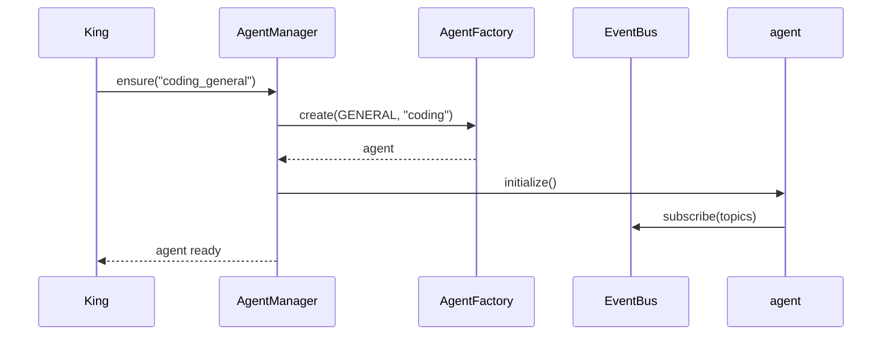

**(10) Flow Diagram**
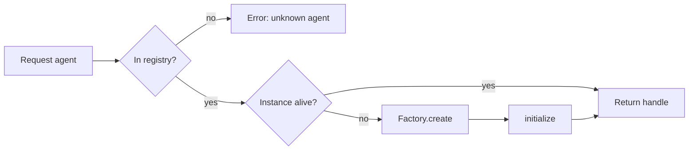

**(11) Future Expansion** — Distributed agent pools across nodes; autoscaling soldier swarms;
hot-reload of agent definitions; per-tenant agent isolation.

**(12) Security** — Only the King (or an admin scope) may spawn/retire agents; every spawn is
audited; agent configs are validated against a schema to prevent injection.

**(13) Testing** — Unit: factory builds correct tier, supervisor restarts on dead heartbeat.
Integration: register→spawn→health→retire round-trip against a fake bus.

**(14) Example Code**
```python
class AgentManager(IAgentManager):
    def __init__(self, registry: AgentRegistry, factory: AgentFactory, bus: EventBus):
        self._registry, self._factory, self._bus = registry, factory, bus
        self._live: dict[str, BaseAgent] = {}

    async def ensure(self, name: str) -> BaseAgent:
        if name in self._live:
            return self._live[name]
        spec = self._registry.get(name)              # raises if unknown
        agent = self._factory.create(spec.tier, name)
        await agent.initialize()
        self._live[name] = agent
        return agent
```

---

## 7.2 Task Manager

**(1) Purpose** — Owns the lifecycle of tasks and subtasks: creation, assignment, state
transitions, retries, and dependency tracking (the task DAG the King produces).

**(2) Folder** — `backend/core/task_manager/`

**(3) Classes** — `TaskManager`, `Task`, `TaskGraph` (DAG), `TaskScheduler`, `RetryPolicy`.

**(4) Interfaces** — `ITaskManager` (`create`, `assign`, `transition`, `get`, `graph_for`),
`ITaskRepository`.

**(5) Responsibilities** — Persist tasks; enforce valid status transitions
(`pending→assigned→running→completed/failed`); resolve dependencies before dispatch; apply
retry/backoff; emit task lifecycle events.

**(6) Dependencies** — Database (repositories), Event Bus, Scheduler, Metrics, Logger.

**(7) Database Tables** — `tasks(id, request_id, parent_task_id, owner_agent, objective,
status, attempts, result_json, error, created_at, updated_at)`,
`task_edges(from_task, to_task)` (DAG dependencies).

**(8) API Endpoints** — `GET /v1/tasks`, `GET /v1/tasks/{id}`, `GET /v1/requests/{id}/tasks`,
`POST /v1/tasks/{id}/cancel`.

**(9) Sequence Diagram**
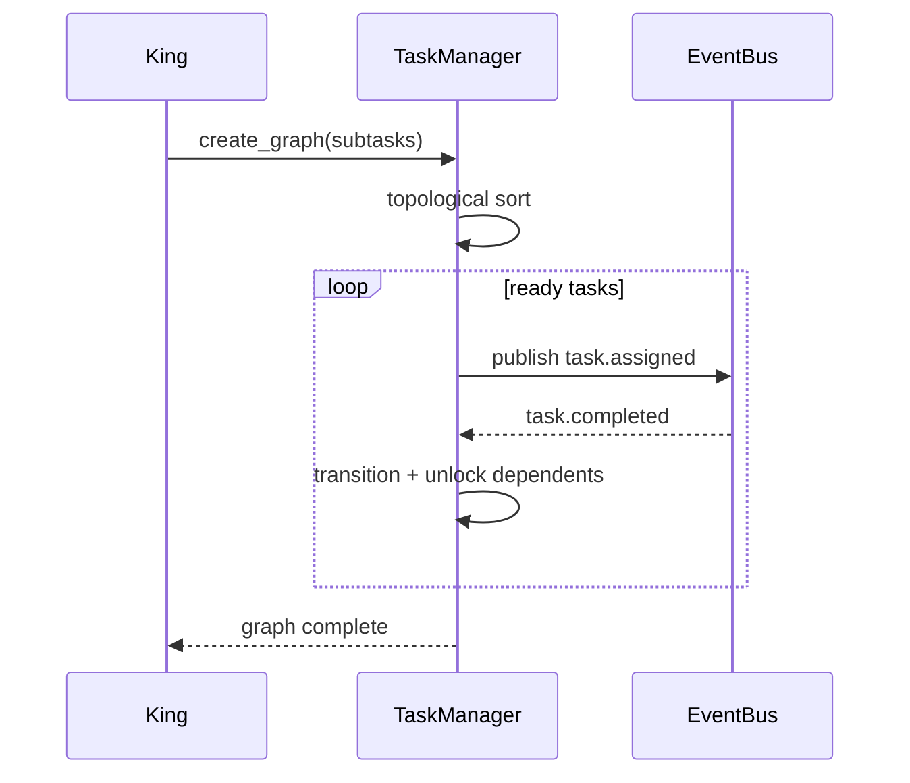

**(10) Flow Diagram**
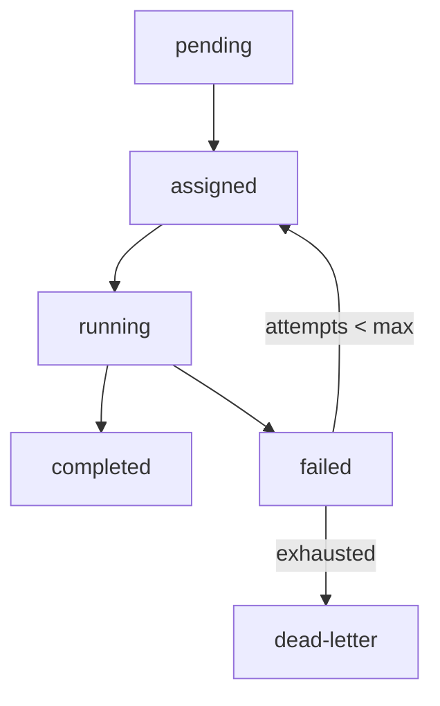

**(11) Future Expansion** — Priority queues, SLA deadlines, speculative parallel execution,
cross-request task deduplication.

**(12) Security** — Task results may contain sensitive data → encrypted at rest; cancellation
restricted to the owning request's principal.

**(13) Testing** — Unit: DAG topological ordering, retry exhaustion → dead-letter.
Integration: full graph executes with a stub agent set.

**(14) Example Code**
```python
async def dispatch_ready(self, graph: TaskGraph) -> None:
    for task in graph.ready():                       # no unmet dependencies
        await self._repo.transition(task.id, TaskStatus.ASSIGNED)
        await self._bus.publish("task.assigned", task.to_event())
```

---

## 7.3 Workflow Engine

**(1) Purpose** — Executes declarative, multi-step workflows (sequential, parallel,
conditional, loop) that compose agents and tools — the reusable "playbooks" above ad-hoc tasks.

**(2) Folder** — `backend/core/workflow_engine/` + definitions in `backend/workflows/`

**(3) Classes** — `WorkflowEngine`, `Workflow`, `Step`, `Branch`, `WorkflowState`,
`WorkflowRunner`. Optional `LangGraphAdapter`.

**(4) Interfaces** — `IWorkflowEngine` (`load`, `run`, `resume`, `status`),
`IStep` (`run(state) -> state`).

**(5) Responsibilities** — Parse workflow definitions; execute steps with branching/looping;
persist state for resumability; surface progress events; support compensation/rollback.

**(6) Dependencies** — Task Manager, Agent Manager, Tool Registry, Memory Manager, Event Bus.

**(7) Database Tables** — `workflows(id, name, version, definition_json)`,
`workflow_runs(id, workflow_id, state_json, status, started_at, finished_at)`.

**(8) API Endpoints** — `POST /v1/workflows/{name}/run`, `GET /v1/workflow-runs/{id}`,
`POST /v1/workflow-runs/{id}/resume`.

**(9) Sequence Diagram**
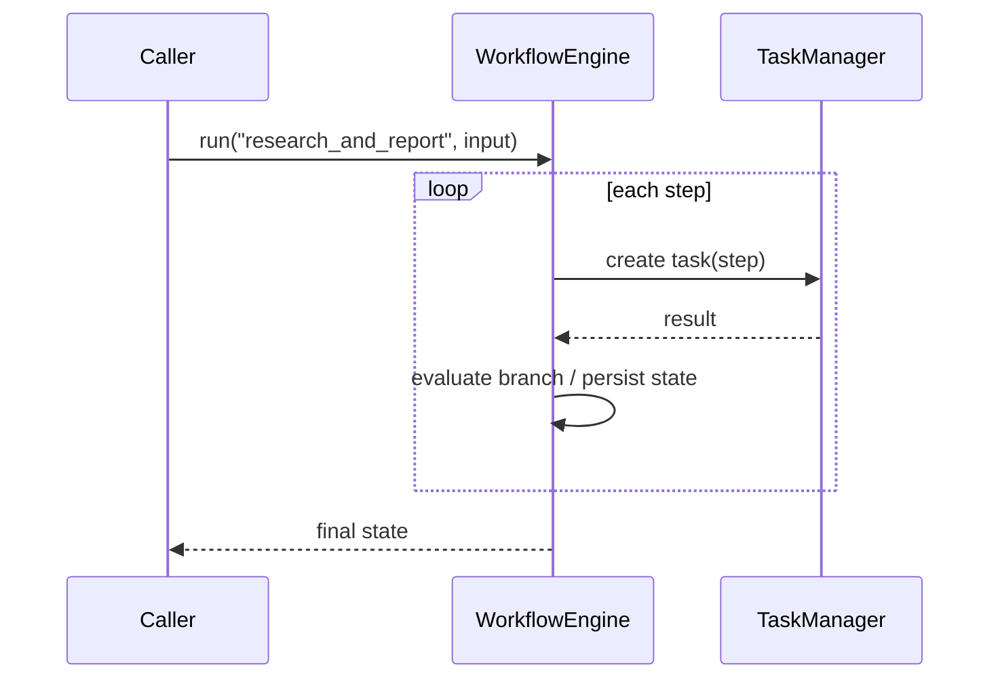

**(10) Flow Diagram**
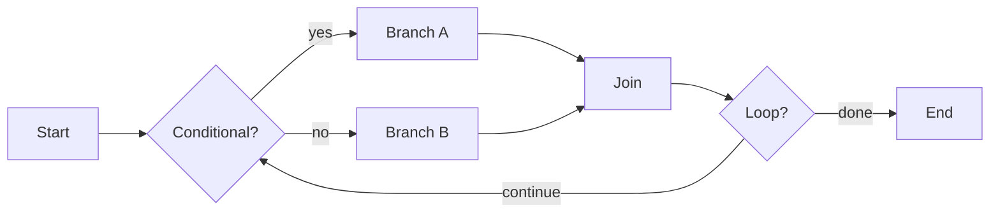

**(11) Future Expansion** — Visual workflow builder, human-in-the-loop approval steps, durable
execution (Temporal-style), versioned migrations of running workflows.

**(12) Security** — Workflow definitions are signed/validated; steps run under the caller's
permission scope; no arbitrary code in definitions (declarative only).

**(13) Testing** — Unit: branch/loop evaluation, resume from persisted state. Integration:
multi-step workflow with mocked agents end-to-end.

**(14) Example Code**
```python
async def run(self, wf: Workflow, state: WorkflowState) -> WorkflowState:
    for step in wf.steps:
        if step.condition and not step.condition(state):
            continue
        state = await step.run(state)
        await self._repo.save_state(state)           # resumable
    return state
```

---

## 7.4 Message Bus & Event Bus

**(1) Purpose** — The **only** channel agents use to communicate. The **Message Bus** does
directed request/reply (point-to-point over Redis streams); the **Event Bus** does
publish/subscribe fan-out for lifecycle events. Together they guarantee zero direct
agent-to-agent coupling.

**(2) Folder** — `backend/core/message_bus/`, `backend/core/event_bus/`

**(3) Classes** — `MessageBus`, `EventBus`, `Subscription`, `Envelope`, `Topic`, `RedisStreamBackend`.

**(4) Interfaces** — `IMessageBus` (`send`, `request`, `reply`), `IEventBus`
(`publish`, `subscribe`, `unsubscribe`).

**(5) Responsibilities** — Reliable delivery, topic routing, consumer groups, at-least-once
semantics, dead-letter on poison messages, backpressure.

**(6) Dependencies** — Redis, Logger, Metrics, Config.

**(7) Database Tables** — None primary (Redis streams). Optional `event_audit(id, topic,
payload_json, ts)` for replay/audit.

**(8) API Endpoints** — Internal only. Debug: `GET /v1/bus/topics`, `GET /v1/bus/lag`.

**(9) Sequence Diagram**
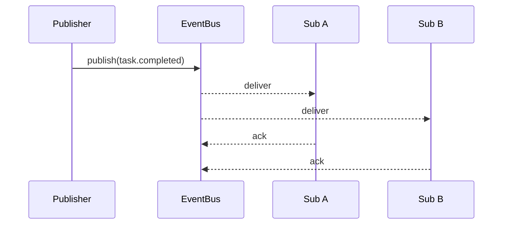

**(10) Flow Diagram**
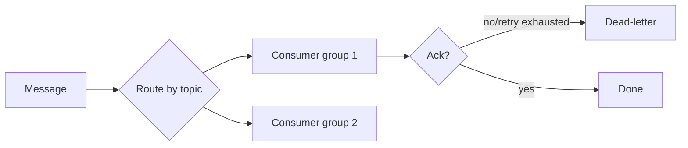

**(11) Future Expansion** — Swap Redis for Kafka/NATS via the backend interface; cross-region
replication; exactly-once semantics.

**(12) Security** — Topic-level ACLs; payloads validated against schemas; sensitive fields
encrypted; no PII in audit topics without masking.

**(13) Testing** — Unit: routing + retry/DLQ logic against an in-memory backend. Integration:
real Redis, consumer-group rebalancing, ordering guarantees.

**(14) Example Code**
```python
class EventBus(IEventBus):
    async def publish(self, topic: str, payload: dict) -> None:
        env = Envelope(topic=topic, payload=payload).model_dump_json()
        await self._redis.xadd(topic, {"data": env})

    async def subscribe(self, topic: str, group: str, handler):
        async for _id, msg in self._backend.consume(topic, group):
            await handler(json.loads(msg["data"]))
            await self._backend.ack(topic, group, _id)
```

---

## 7.5 Tool Registry

**(1) Purpose** — Central catalogue of every callable capability (LLM providers, REST APIs,
MCP servers, Python functions, Docker containers). Soldiers resolve tools by name here.

**(2) Folder** — `backend/core/tool_registry/` (+ adapters in `backend/tools/`)

**(3) Classes** — `ToolRegistry`, `ToolSpec`, `ToolFactory`, `ToolInvocation`,
adapter strategies (`OpenAIAdapter`, `AnthropicAdapter`, `GeminiAdapter`, `RestAdapter`,
`McpAdapter`, `PythonFnAdapter`, `DockerAdapter`).

**(4) Interfaces** — `IToolRegistry` (`register`, `get`, `list`, `invoke`),
`ITool` (`invoke(args) -> result`, `schema()`).

**(5) Responsibilities** — Register tools with JSON schemas; validate args; route to the
correct adapter (Strategy); enforce rate limits/quotas; record invocation metrics.

**(6) Dependencies** — Permission Manager, Metrics, Logger, Config, provider SDKs.

**(7) Database Tables** — `tools(id, name, kind, schema_json, enabled)`,
`tool_invocations(id, tool_id, agent_id, args_hash, status, latency_ms, ts)`.

**(8) API Endpoints** — `GET /v1/tools`, `GET /v1/tools/{name}`, `POST /v1/tools/{name}/invoke`
(admin/test).

**(9) Sequence Diagram**
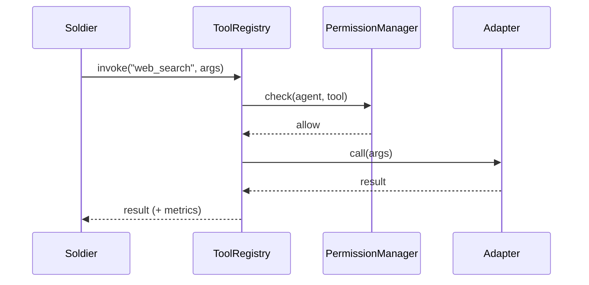

**(10) Flow Diagram**
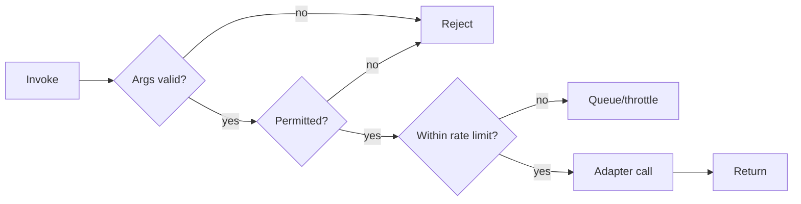

**(11) Future Expansion** — Tool marketplace, semantic tool selection (embed tool descriptions),
auto-generated adapters from OpenAPI specs, sandboxed untrusted tools.

**(12) Security** — Per-agent tool allow-lists; secrets injected at call time (never stored in
specs); Docker/Python tools run sandboxed; output size limits to prevent abuse.

**(13) Testing** — Unit: schema validation, adapter selection. Integration: each adapter against
a mock/live provider; rate-limit enforcement.

**(14) Example Code**
```python
async def invoke(self, name: str, args: dict, *, agent_id: str) -> Any:
    spec = self._tools[name]
    spec.validate(args)
    await self._permissions.require(agent_id, f"tool:{name}")
    adapter = self._factory.for_kind(spec.kind)
    with self._metrics.timer("tool.invoke", tool=name):
        return await adapter.call(spec, args)
```

---

## 7.6 Memory Manager (façade over the Memory System)

**(1) Purpose** — Unified API over short-term (Redis), long-term (PostgreSQL), and semantic
(Qdrant) memory, plus conversation/task/project/knowledge scopes. Agents never touch storage
backends directly.

**(2) Folder** — `backend/core/memory_manager/` (+ backends in `backend/memory/`)

**(3) Classes** — `MemoryManager`, `ShortTermStore`, `LongTermStore`, `SemanticStore`,
`MemoryRecord`, `EmbeddingService`, scope facades (`ConversationMemory`, `TaskMemory`,
`ProjectMemory`, `KnowledgeMemory`).

**(4) Interfaces** — `IMemoryManager` (`remember`, `recall`, `search`, `forget`, `summarize`),
`IVectorStore`, `IEmbeddingService`.

**(5) Responsibilities** — Route writes/reads to the right tier; embed + upsert semantic
memories; semantic search with filters; TTL/eviction for short-term; summarisation/compaction
of long histories.

**(6) Dependencies** — Redis, PostgreSQL, Qdrant, an embeddings provider, Config, Metrics.

**(7) Database Tables** — `memories(id, scope, owner_id, kind, content, metadata_json, ts)`;
Qdrant collection `semantic_memory(vector, payload{memory_id, scope, owner})`;
Redis keys `stm:{session}:{k}`.

**(8) API Endpoints** — `POST /v1/memory`, `GET /v1/memory/search`, `DELETE /v1/memory/{id}`,
`GET /v1/sessions/{id}/memory`.

**(9) Sequence Diagram**
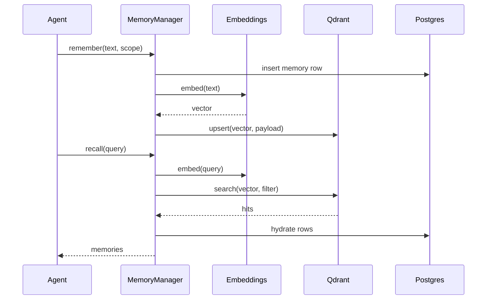

**(10) Flow Diagram**
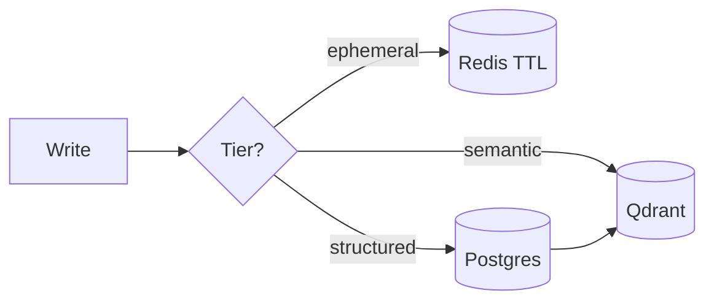

**(11) Future Expansion** — Hierarchical memory consolidation (episodic→semantic), forgetting
curves, per-user memory encryption, multi-modal embeddings (image/audio).

**(12) Security** — Scoped access by owner/tenant; PII tagging + redaction; encryption at rest;
right-to-be-forgotten via `forget` cascading to all tiers.

**(13) Testing** — Unit: tier routing, eviction. Integration: embed→upsert→search recall@k,
forget cascade across Postgres + Qdrant + Redis.

**(14) Example Code**
```python
async def recall(self, query: str, *, scope: str, owner: str, k: int = 8):
    vec = await self._embeddings.embed(query)
    hits = await self._vectors.search(vec, k=k,
                                      flt={"scope": scope, "owner": owner})
    return await self._long_term.hydrate([h.payload["memory_id"] for h in hits])
```

---

## 7.7 Scheduler

**(1) Purpose** — Runs time-based and recurring work: cron jobs, delayed tasks, reminders,
periodic agent health sweeps, and workflow triggers.

**(2) Folder** — `backend/core/scheduler/`

**(3) Classes** — `Scheduler`, `ScheduledJob`, `CronTrigger`, `IntervalTrigger`,
`DateTrigger`, `JobStore`. Optional `CeleryBeatAdapter`.

**(4) Interfaces** — `IScheduler` (`schedule`, `cancel`, `list`, `next_run`).

**(5) Responsibilities** — Persist schedules; fire jobs (publishing to the Event Bus);
guarantee single-fire across replicas via Redis locks; backfill/missed-run policy.

**(6) Dependencies** — Redis (locks), Database (JobStore), Event Bus, Config.

**(7) Database Tables** — `scheduled_jobs(id, name, trigger_json, payload_json, enabled,
last_run, next_run)`, `job_runs(id, job_id, status, ts)`.

**(8) API Endpoints** — `POST /v1/schedules`, `GET /v1/schedules`, `DELETE /v1/schedules/{id}`.

**(9) Sequence Diagram**
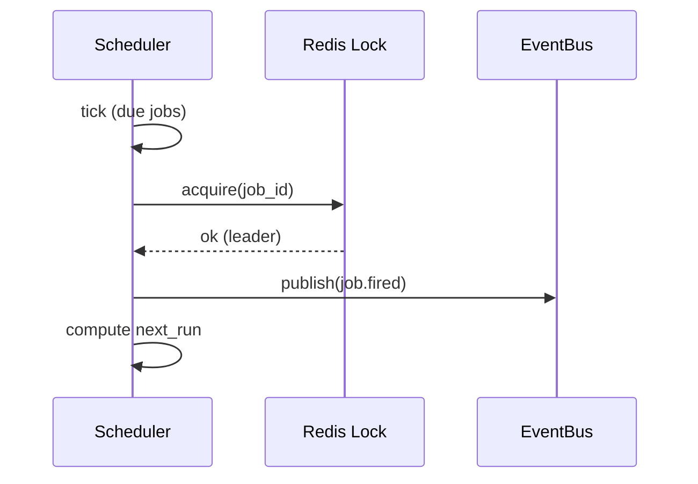

**(10) Flow Diagram**
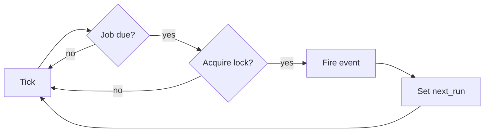

**(11) Future Expansion** — Distributed scheduler with sharded ownership, timezone-aware cron,
SLA-aware deferral, jittered fan-out to avoid thundering herds.

**(12) Security** — Schedules run under a defined principal/scope; only authorised principals
can create system-level jobs; payloads validated.

**(13) Testing** — Unit: trigger computation, missed-run policy. Integration: leader election
under two replicas (exactly-one fire).

**(14) Example Code**
```python
async def tick(self) -> None:
    for job in await self._store.due(now()):
        if await self._lock.acquire(f"job:{job.id}", ttl=30):
            await self._bus.publish("job.fired", job.payload)
            await self._store.set_next_run(job.id, job.trigger.next())
```

---

## 7.8 Permission Manager

**(1) Purpose** — Centralised authorization: decides whether a principal (user or agent) may
perform an action (call a tool, spawn an agent, read a memory scope). Backs RBAC.

**(2) Folder** — `backend/core/permission_manager/` (+ `backend/security/`)

**(3) Classes** — `PermissionManager`, `Role`, `Policy`, `Scope`, `PermissionError`.

**(4) Interfaces** — `IPermissionManager` (`require`, `check`, `grant`, `revoke`).

**(5) Responsibilities** — Evaluate policies; map roles→scopes; enforce per-agent tool
allow-lists; emit authorization audit events.

**(6) Dependencies** — Database, Logger (audit), Config.

**(7) Database Tables** — `roles(id, name)`, `permissions(id, scope)`,
`role_permissions(role_id, permission_id)`, `principal_roles(principal_id, role_id)`,
`audit_log(id, principal, action, decision, ts)`.

**(8) API Endpoints** — `GET /v1/roles`, `POST /v1/roles/{id}/grant`,
`POST /v1/principals/{id}/roles`.

**(9) Sequence Diagram**
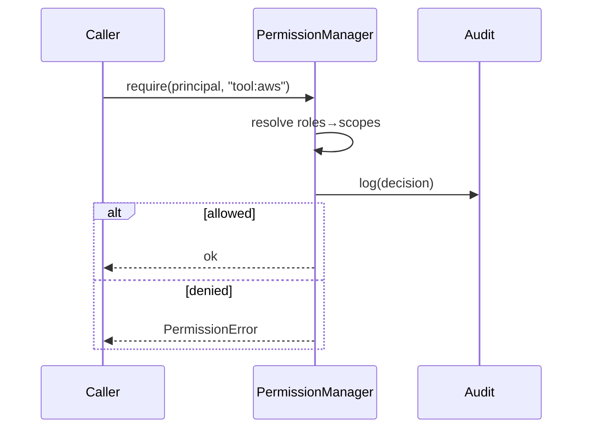

**(10) Flow Diagram**
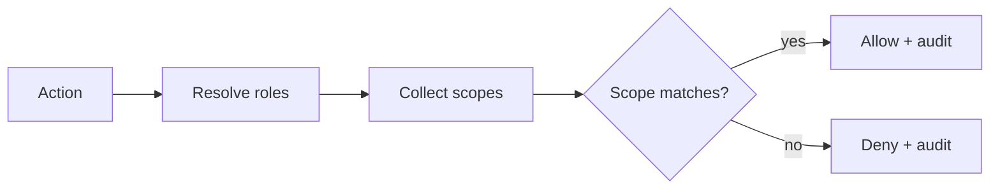

**(11) Future Expansion** — ABAC (attribute-based) policies, policy-as-code (OPA/Rego),
just-in-time elevation with approval, per-tenant policy sets.

**(12) Security** — This *is* the security core; deny-by-default; every decision audited;
policies are tamper-evident.

**(13) Testing** — Unit: allow/deny matrices, deny-by-default. Integration: end-to-end tool
call blocked when scope missing.

**(14) Example Code**
```python
async def require(self, principal: str, scope: str) -> None:
    if not await self.check(principal, scope):
        await self._audit("deny", principal, scope)
        raise PermissionError(f"{principal} lacks {scope}")
    await self._audit("allow", principal, scope)
```

---

## 7.9 Platform Services — Config · Logger · Metrics · Health

**(1) Purpose** — The observability + configuration backbone every module imports.
**Config** loads typed settings; **Logger** emits structured JSON logs; **Metrics** exposes
Prometheus counters/histograms; **Health** aggregates component readiness/liveness.

**(2) Folder** — `backend/core/config/`, `backend/core/logger/`, `backend/core/metrics/`,
`backend/core/health/`

**(3) Classes** — `Settings`, `LoggerFactory`, `MetricsRegistry`, `Timer`, `HealthService`,
`ComponentHealth`.

**(4) Interfaces** — `ILogger`, `IMetrics` (`counter`, `histogram`, `timer`),
`IHealthService` (`register`, `report`).

**(5) Responsibilities** — Single typed config source; correlation-id-tagged logs; latency &
error metrics for every agent/tool call; `/health` and `/metrics` endpoints.

**(6) Dependencies** — `prometheus-client`, `structlog`, `pydantic-settings`.

**(7) Database Tables** — None (logs/metrics go to CloudWatch/Prometheus). Optional
`health_snapshots(component, status, ts)`.

**(8) API Endpoints** — `GET /health`, `GET /health/ready`, `GET /metrics`.

**(9) Sequence Diagram**
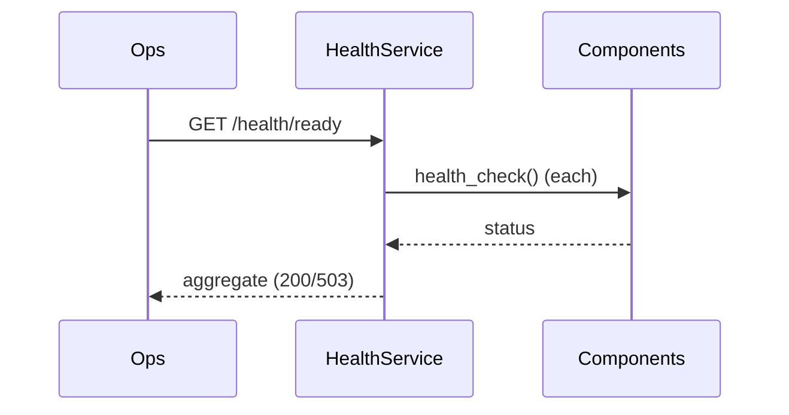

**(10) Flow Diagram**
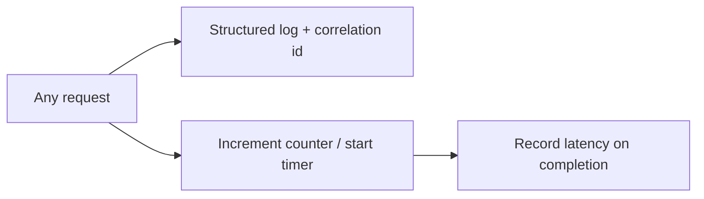

**(11) Future Expansion** — OpenTelemetry tracing, log-based anomaly detection, SLO/error-budget
dashboards, dynamic log-level changes at runtime.

**(12) Security** — Logs are PII-scrubbed; `/metrics` is network-restricted; config secrets
come from AWS Secrets Manager, never committed.

**(13) Testing** — Unit: metric emission, health aggregation (one unhealthy → 503).
Integration: `/health` and `/metrics` scrape format.

**(14) Example Code**
```python
class HealthService(IHealthService):
    async def report(self) -> tuple[int, dict]:
        results = {name: await c.health_check() for name, c in self._components.items()}
        ok = all(r["status"] == "ok" for r in results.values())
        return (200 if ok else 503), results
```

---

## 7.10 King Agent

**(1) Purpose** — The orchestrator. Receives the user objective, plans a task DAG, assigns to
Generals, monitors, merges results, returns the final answer. **Performs no domain work.**

**(2) Folder** — `backend/king/`

**(3) Classes** — `KingAgent(BaseAgent)`, `Planner`, `Decomposer`, `Aggregator`, `ProgressMonitor`.

**(4) Interfaces** — Implements `BaseAgent`; uses `ITaskManager`, `IAgentManager`,
`IMemoryManager`, `IEventBus`.

**(5) Responsibilities** — Understand intent; decompose into subtasks with dependencies; select
Generals; track progress; handle partial failures; synthesise the final response.

**(6) Dependencies** — Task Manager, Agent Manager, Memory Manager, Event Bus, Tool Registry
(planning LLM only).

**(7) Database Tables** — Uses `tasks`, `task_edges`, writes outcome to `memories`/`requests`.
`requests(id, user_id, objective, status, final_result, created_at)`.

**(8) API Endpoints** — `POST /v1/chat`, `POST /v1/requests`, `GET /v1/requests/{id}`,
`WS /v1/stream`.

**(9) Sequence Diagram** — see §4.1 (request lifecycle).

**(10) Flow Diagram**
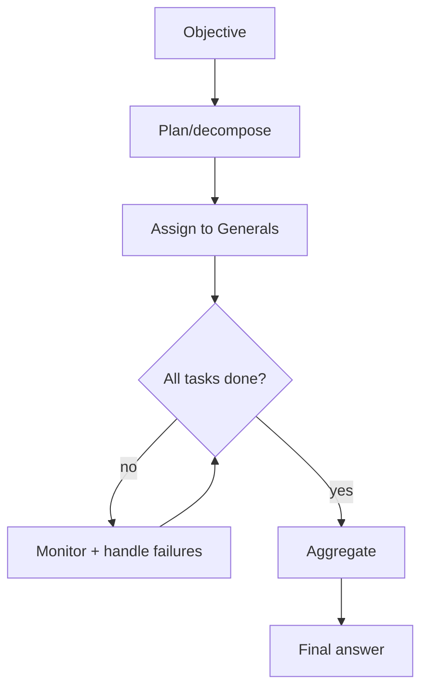

**(11) Future Expansion** — Multi-step replanning on failure, cost/latency-aware planning,
parallel speculative branches, learned routing from history.

**(12) Security** — Runs under the requesting user's scope; cannot exceed user permissions; all
delegations audited; guards against prompt-injection escalating privileges.

**(13) Testing** — Unit: decomposition correctness, aggregation merging. Integration: full
request across stub Generals/Soldiers; failure-recovery path.

**(14) Example Code**
```python
class KingAgent(BaseAgent):
    tier = AgentTier.KING

    async def execute(self, request: AgentRequest) -> AgentResponse:
        context = await self._memory.recall(request.objective, scope="conversation",
                                             owner=request.context["user_id"])
        graph = await self._planner.decompose(request, context)
        results = await self._tasks.run_graph(graph)        # dispatches to Generals
        answer = self._aggregator.merge(results)
        return AgentResponse(request_id=request.request_id, agent_id=self.agent_id,
                             tier=self.tier, status=TaskStatus.COMPLETED, result=answer)
```

---

## 7.11 General Agents

**(1) Purpose** — Domain coordinators. Each General owns one domain, receives tasks from the
King, decomposes into soldier-level subtasks, and aggregates soldier results.

**(2) Folder** — `backend/generals/{knowledge,planning,execution,memory,coding,media,finance,
communication,system,automation}/`

**(3) Classes** — `BaseGeneral(BaseAgent)` + one subclass per domain
(`CodingGeneral`, `FinanceGeneral`, …); `SoldierRouter`.

**(4) Interfaces** — Implements `BaseAgent`; uses `IAgentManager` (to reach soldiers),
`IEventBus`, `IToolRegistry`.

**(5) Responsibilities** — Validate the task fits its domain; pick the right soldiers; sequence
soldier calls; merge into a domain-level result; report progress to the King.

**(6) Dependencies** — Agent Manager, Event Bus, Tool Registry, Memory Manager.

**(7) Database Tables** — Reuses `tasks`/`task_edges`; no domain-specific tables in Phase 1.

**(8) API Endpoints** — Internal (event-driven). Debug: `GET /v1/agents?tier=general`.

**(9) Sequence Diagram**
```mermaid
sequenceDiagram
    participant King
    participant Gen as General
    participant S1 as Soldier A
    participant S2 as Soldier B
    King->>Gen: task
    Gen->>S1: subtask
    Gen->>S2: subtask
    S1-->>Gen: result
    S2-->>Gen: result
    Gen-->>King: merged result
```

**(10) Flow Diagram**
```mermaid
flowchart LR
    T[Task] --> V{In my domain?}
    V -- no --> Rej[Reject → King reassigns]
    V -- yes --> R[Route to soldiers] --> A[Aggregate] --> Ret[Return]
```

**(11) Future Expansion** — Learned soldier selection, domain-specific memory, sub-general
hierarchies for very large domains.

**(12) Security** — Inherits caller scope; can only invoke soldiers/tools within its domain
allow-list.

**(13) Testing** — Unit: routing + aggregation per domain. Integration: General + its soldiers
on representative tasks.

**(14) Example Code**
```python
class BaseGeneral(BaseAgent):
    tier = AgentTier.GENERAL
    domain: str
    soldiers: list[str]

    async def execute(self, request: AgentRequest) -> AgentResponse:
        chosen = self._router.select(request, self.soldiers)
        results = await asyncio.gather(*[self._call(s, request) for s in chosen])
        return self._merge(request, results)
```

---

## 7.12 Soldier Agents

**(1) Purpose** — Single-responsibility workers. Each soldier does exactly one thing (search the
web, run git, query a stock price, OCR a file) and returns an `AgentResponse`.

**(2) Folder** — `backend/soldiers/base/` (BaseSoldier) + grouped packages
(`knowledge/`, `media/`, `finance/`, `communication/`, `system/`, `automation/`).

**(3) Classes** — `BaseSoldier(BaseAgent)` + one class per soldier
(`InternetSoldier`, `GitSoldier`, `StockSoldier`, `OcrSoldier`, …, 40+).

**(4) Interfaces** — Implements `BaseAgent`; each soldier wraps exactly one tool/capability via
`IToolRegistry`.

**(5) Responsibilities** — Validate input; invoke its one tool; normalise output to the common
schema; never delegate to other agents.

**(6) Dependencies** — Tool Registry, Memory Manager (optional), Event Bus.

**(7) Database Tables** — None of their own; invocations recorded in `tool_invocations`.

**(8) API Endpoints** — Internal. Debug: `GET /v1/agents?tier=soldier`.

**(9) Sequence Diagram**
```mermaid
sequenceDiagram
    participant Gen as General
    participant Sol as Soldier
    participant TR as ToolRegistry
    Gen->>Sol: subtask
    Sol->>TR: invoke(one tool)
    TR-->>Sol: tool result
    Sol-->>Gen: AgentResponse
```

**(10) Flow Diagram**
```mermaid
flowchart LR
    I[Subtask] --> V{Valid input?}
    V -- no --> F[Fail fast]
    V -- yes --> X[Invoke single tool] --> N[Normalise] --> R[Return]
```

**(11) Future Expansion** — Hundreds more soldiers via the same base; auto-registration from a
manifest; sandboxed third-party soldiers.

**(12) Security** — Minimal scope (one tool); inputs sanitised; outputs size-limited;
untrusted soldiers run in Docker isolation.

**(13) Testing** — Unit: input validation + output normalisation with a mocked tool.
Integration: soldier against a live/mock tool.

**(14) Example Code**
```python
class BaseSoldier(BaseAgent):
    tier = AgentTier.SOLDIER
    tool_name: str

    async def execute(self, request: AgentRequest) -> AgentResponse:
        if not await self.validate(request):
            return self._fail(request, "invalid input")
        result = await self._tools.invoke(self.tool_name, request.context,
                                          agent_id=self.agent_id)
        return self._ok(request, result)
```

---

## 7.13 API Layer

**(1) Purpose** — The external boundary: REST + WebSocket access to the King, streaming
responses, auth, rate limiting, versioning, and OpenAPI docs.

**(2) Folder** — `backend/api/` (`main.py`, `middleware/`, `v1/routes/`, `v1/websockets/`)

**(3) Classes** — `FastAPI` app, routers, `AuthMiddleware`, `RateLimitMiddleware`,
`StreamingResponder`, `WebSocketManager`.

**(4) Interfaces** — REST controllers depend on application services (not domain internals).

**(5) Responsibilities** — Validate/authenticate requests; route to services; stream tokens;
manage WebSocket sessions; enforce rate limits; serve OpenAPI.

**(6) Dependencies** — Security (JWT/OAuth2), King/services, Redis (rate limits), Logger/Metrics.

**(7) Database Tables** — `api_keys(id, user_id, hash, scopes, created_at)`,
`sessions(id, user_id, started_at, last_seen)`.

**(8) API Endpoints** — `POST /v1/auth/login`, `POST /v1/auth/refresh`, `POST /v1/chat`,
`GET /v1/requests/{id}`, `WS /v1/stream`, `GET /v1/agents`, `GET /v1/tools`, `GET /health`,
`GET /metrics`, `GET /docs` (OpenAPI).

**(9) Sequence Diagram**
```mermaid
sequenceDiagram
    actor U as Client
    participant API
    participant Auth
    participant King
    U->>API: POST /v1/chat (JWT)
    API->>Auth: verify token + scopes
    Auth-->>API: principal
    API->>King: AgentRequest
    King-->>API: stream chunks
    API-->>U: SSE/WebSocket stream
```

**(10) Flow Diagram**
```mermaid
flowchart LR
    R[Request] --> A{Auth ok?}
    A -- no --> 401
    A -- yes --> RL{Under rate limit?}
    RL -- no --> 429
    RL -- yes --> H[Handler] --> S[Stream/return]
```

**(11) Future Expansion** — GraphQL gateway, gRPC for internal services, API versioning v2,
per-tenant quotas, signed webhooks.

**(12) Security** — JWT/OAuth2, HTTPS-only, CORS allow-list, rate limiting, input validation,
output filtering; secrets via Secrets Manager.

**(13) Testing** — Unit: middleware (auth/rate-limit). Integration: endpoint contract tests +
WebSocket streaming; OpenAPI schema snapshot.

**(14) Example Code**
```python
@router.post("/v1/chat")
async def chat(req: ChatRequest, principal=Depends(auth)):
    request = AgentRequest(objective=req.message,
                           context={"user_id": principal.id})
    return StreamingResponse(king.stream(request), media_type="text/event-stream")
```

---

## 7.14 Security (cross-cutting)

**(1) Purpose** — Protect identity, data, and actions across the platform: authentication,
authorization, secrets, encryption, and audit.

**(2) Folder** — `backend/security/` (+ Permission Manager in core).

**(3) Classes** — `JwtService`, `OAuth2Provider`, `PasswordHasher`, `SecretsClient`,
`AuditLogger`, `Encryptor`.

**(4) Interfaces** — `IAuthService` (`authenticate`, `issue`, `verify`), `ISecrets` (`get`).

**(5) Responsibilities** — Issue/verify JWTs; OAuth2 flows; hash passwords (bcrypt/argon2);
fetch secrets from AWS Secrets Manager; encrypt sensitive columns; write audit trail.

**(6) Dependencies** — `python-jose`, `passlib`, AWS Secrets Manager, Database (audit).

**(7) Database Tables** — `users(id, email, password_hash, status)`,
`oauth_accounts(id, user_id, provider, provider_uid)`, `audit_log` (shared with Permissions).

**(8) API Endpoints** — `POST /v1/auth/login`, `POST /v1/auth/oauth/{provider}`,
`POST /v1/auth/refresh`, `POST /v1/auth/logout`.

**(9) Sequence Diagram**
```mermaid
sequenceDiagram
    actor U
    participant API
    participant Auth as JwtService
    U->>API: login(email, pw)
    API->>Auth: verify + issue
    Auth-->>API: access + refresh token
    API-->>U: tokens
```

**(10) Flow Diagram**
```mermaid
flowchart LR
    L[Login] --> V{Valid creds?}
    V -- no --> D[401 + audit]
    V -- yes --> T[Issue JWT] --> Au[Audit success]
```

**(11) Future Expansion** — MFA, passkeys/WebAuthn, key rotation, mTLS between services,
anomaly-based session revocation.

**(12) Security** — Deny-by-default; short-lived access tokens + rotating refresh; secrets never
logged; encryption at rest + in transit (HTTPS).

**(13) Testing** — Unit: token issue/verify/expiry, password hashing. Integration: full
login→refresh→protected-call flow; RBAC enforcement.

**(14) Example Code**
```python
class JwtService(IAuthService):
    def issue(self, sub: str, scopes: list[str]) -> str:
        payload = {"sub": sub, "scopes": scopes,
                   "exp": now() + timedelta(minutes=settings.access_ttl)}
        return jwt.encode(payload, settings.jwt_secret, algorithm="HS256")
```

---

## 8. Global Database Schema (Phase 1 view)

```mermaid
erDiagram
    users ||--o{ requests : makes
    requests ||--o{ tasks : decomposes
    tasks ||--o{ task_edges : depends
    agents ||--o{ agent_heartbeats : emits
    tools ||--o{ tool_invocations : invoked
    users ||--o{ memories : owns
    roles ||--o{ role_permissions : has
    principal_roles }o--|| roles : assigns
    requests {
      uuid id PK
      uuid user_id FK
      string objective
      string status
      json final_result
    }
    tasks {
      uuid id PK
      uuid request_id FK
      uuid parent_task_id
      string owner_agent
      string status
      int attempts
    }
    memories {
      uuid id PK
      string scope
      uuid owner_id
      string kind
      text content
    }
```

---

## 9. Monitoring & Logging (platform-wide)

Every action — agent step, tool call, DB query, API request — emits a structured log (with a
correlation id that threads a whole request) and a metric (counter + latency histogram). Health
endpoints aggregate component `health_check()`s. Prometheus scrapes `/metrics`; dashboards are
Grafana-compatible; AWS CloudWatch collects logs in production. Tracing (OpenTelemetry) is the
Phase-2+ extension point.

---

## 10. Build Roadmap & Approval Gates

| Phase | Deliverable | Gate |
|---|---|---|
| **1** | **Architecture & folder structure (this doc + scaffold)** | **← approve to continue** |
| 2 | Core framework (Agent/Task/Workflow/Bus/Registry/Memory/Scheduler/Permissions/Observability) | approve |
| 3 | Base agent system (BaseAgent/BaseGeneral/BaseSoldier + schema) | approve |
| 4 | King agent (planner/decomposer/aggregator) | approve |
| 5 | General agents (10) | approve |
| 6 | Soldier agents (40+) | approve |
| 7 | Memory system (Redis/Postgres/Qdrant) | approve |
| 8 | Tool orchestration (providers + MCP + adapters) | approve |
| 9 | API layer (REST/WS/auth/streaming) | approve |
| 10 | Flutter app | approve |
| 11 | Docker (multi-stage, compose, prod) | approve |
| 12 | AWS deployment (ECS/Fargate, RDS, ElastiCache, Qdrant, CloudFront, …) | approve |

---

## 11. What Exists After Phase 1

- Full `god_mode_ai/` directory tree with Python packages (`__init__.py`) for every module.
- Shared contracts stubbed: `schemas/agent.py` (`AgentRequest`/`AgentResponse`),
  `core/base_agent.py` (`BaseAgent`).
- Entry points stubbed: `api/main.py`, `config/settings.py`.
- Infra stubbed: `docker/Dockerfile`, `docker/docker-compose.yml`, `.env.example`,
  `requirements.txt`, `pyproject.toml`.
- Per-area READMEs explaining each subsystem and the phase that fills it.

Nothing is runnable beyond the `/health` placeholder — by design. Phase 2 implements the Core
Framework against the contracts defined here.

---

*Approve this architecture to proceed to Phase 2: Core Framework.*
